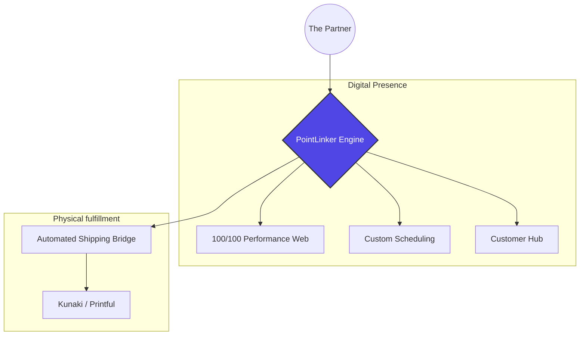

# 💿 PointLinker | Technical Partner.

**A Centralized Engine for Independent Artists, Creators & Small Businesses.**

PointLinker is a specialized technical studio that builds high-performance digital ecosystems. We bridge the gap between creative vision and operational reality, allowing indie artists, creators and small businesses to own their infrastructure without the technical overhead.

---

## 🌐 The Ecosystem Approach
In an era of "link-in-bios" and clunky plugins, PointLinker offers a unified **Centralized Engine**. We bridge the gap between your digital presence and the physical world.

### 🎸 Independent Artists & Creators
Your music and art deserve more than a link-in-bio. We build immersive galleries and media hubs that handle:
* **Digital-to-Physical Media:** Automated fulfillment of CDs and Vinyl via Kunaki.
* **Direct-to-Fan Commerce:** High-margin apparel and merch via Printful.
* **Media Optimization:** Lightning-fast audio/visual players designed for mobile-first fans.

### ✂️ Small biz Ecosystems
For Salons, Studios, Consultants and other small businesses who require a premium digital "front door."
* **Booking Engines:** Custom-designed scheduling that eliminates third-party platform fees.
* **Brand Storytelling:** High-fidelity, SEO-optimized layouts that convert visitors into lifelong clients.
* **Automated Admin:** A centralized dashboard to manage services, inventory, and clients, tracking sales, appointments and interactions
* **Client Management:** A unified dashboard to track appointments, sales, and interactions.

## 🤝 Your Long-Term Technical Partner
We don't just "hand over" a website. We act as your **Technical Co-Founder**. PointLinker provides the high-level engineering oversight typically reserved for enterprise companies, scaled down for independent creators and boutique brands.

* **Proactive Management:** We handle the server architecture, security patches, and performance tuning so you never have to see a line of code.
* **Scalable Strategy:** As your fan base or client list grows, we evolve your engine to handle the load—ensuring zero downtime during high-traffic launches.
* **The "CTO" Lens:** We vet third-party integrations (like payment gateways or fulfillment APIs) to ensure your ecosystem remains lean, fast, and secure.
  
---

## 🚀 The PointLinker Architecture
We utilize a **"Core + Flavor"** model. You get the stability of an industrial-grade engine with the total creative freedom of a custom-built "Flavor."

## ⚡ Why an "Engine" instead of a "Site"?

* **100/100 Lighthouse Performance:** We don't use templates or bloated page builders. We build for raw speed, search visibility (SEO), and maximum conversion.
* **Data Sovereignty:** You aren't renting a platform or a "subscription box"; you own your engine. Your data and assets are hosted on dedicated, secure European hardware that you control.
* **Automation-First:** Every PointLinker ecosystem is engineered to be a silent employee. We design for high-efficiency workflows that reduce your manual administrative workload by at least **15 hours per week**.

---

## 🤝 Join the Ecosystem

PointLinker is not a mass-market service; it is a **Technical Partnership**. We work with a select number of independent artists and boutique brands to ensure every digital ecosystem we deploy is a masterpiece of engineering and efficiency.

### **The Onboarding Path:**
1. **The Technical Deep Dive:** We analyze your current "friction points", where are you losing time? Where is your current site failing to convert?
2. **Flavor Selection:** We determine which PointLinker "Flavor" (Artist, Salon, Boutique) fits your operational needs.
3. **Deployment & Integration:** We build your engine and bridge it to your physical fulfillment partners (Kunaki/Printful).
4. **Active Partnership:** We move into a managed-service phase, acting as your off-site CTO to ensure 100/100 performance as you scale.

### 📬 Start the Conversations
**[Technical White Paper](https://www.google.com/search?q=https://github.com/PointLinkerOrg/pointlinker-public-demo/blob/main/WHITE-PAPER.md)** | **[Inquire via LinkedIn](https://www.linkedin.com/company/pointlinker/)**

---
