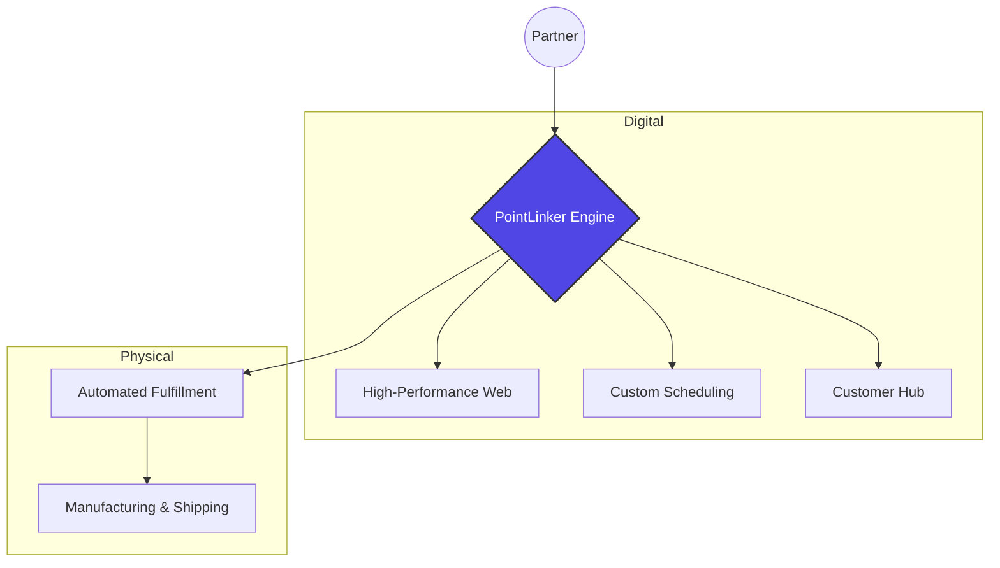

# 💿 PointLinker — Technical Partner

**A centralized engine for independent artists, creators, and small businesses.**

PointLinker is a specialised technical studio that designs, deploys, and operates high-performance digital ecosystems.  
We bridge creative vision and operational reality, enabling partners to own their infrastructure without carrying long-term technical overhead.

This is not a template service or a plug-and-play SaaS.  
It is a long-term technical partnership.

---

## 🌐 The Ecosystem Model

Most digital presences are fragmented: link-in-bios, plugins, third-party dashboards, and rented platforms.

PointLinker replaces this sprawl with a **centralized engine**, a modular core that connects digital presence, operations, and physical fulfillment into a single, coherent system.

Each ecosystem is custom-configured on top of a shared, hardened core and designed to evolve into scalable, reusable infrastructure as operations grow.

---

## 🎸 Independent Artists & Creators

Your work deserves more than outbound links.

We build immersive, performance-driven media hubs that support:

- **Digital-to-Physical Media**  
  Automated CD and vinyl fulfillment through integrated manufacturing partners.

- **Direct-to-Fan Commerce**  
  High-margin merchandise pipelines powered by on-demand production.

- **Media-First Experiences**  
  Fast, mobile-optimized audio and visual players designed for fan engagement, not page views.

---

## ✂️ Small Business Ecosystems

For salons, studios, consultants, and boutique service businesses that require a premium digital front door.

- **Custom Booking Engines**  
  Purpose-built scheduling systems that eliminate dependency on third-party platforms.

- **Brand-Led Interfaces**  
  SEO-optimized, high-fidelity layouts that convert visitors into long-term clients.

- **Operational Automation**  
  Centralized management of services, appointments, inventory, and customer interactions.

---

## 🤝 A Long-Term Technical Partnership

PointLinker does not “deliver and disappear.”

We operate as an external **Technical Co-Founder**, providing engineering oversight typically reserved for larger organizations.

- **Proactive Infrastructure Management**  
  Architecture, security updates, deployments, and performance tuning handled continuously.

- **Scalable Systems Thinking**  
  Ecosystems evolve alongside audience growth, traffic spikes, and operational complexity.

- **CTO-Level Oversight**  
  Third-party services and integrations are evaluated for performance, reliability, and long-term sustainability.

---

## 🧱 The PointLinker Architecture

PointLinker follows a **Core + Flavor** model:

- A shared, versioned backend core maintained centrally
- Dedicated deployments per partner, extended with domain-specific “flavors”
- Strict data and operational isolation between partners

This approach ensures consistency and security while preserving independence for every ecosystem.

---

## 🏗 Infrastructure Principles

- **Multi-Tenant by Design**
  Each partner operates on an isolated backend instance with dedicated databases.

- **Shared, Hardened Core**
  Core systems are centrally maintained, versioned, and improved without fragmenting deployments.

- **European-Based Infrastructure**
  All systems are hosted on European infrastructure, supporting data ownership and regulatory alignment.

- **Automation-First Operations**
  The ecosystem is engineered to function as a silent operational layer, reducing manual workload rather than adding tools.

---

## ⚡ Why an Engine — Not a Website

- **Performance by Design:**
  No page builders, no bloated templates. Built for speed, SEO, and conversion.

- **Data Ownership:**
  Partners retain ownership of their data, content, and brand assets.
  PointLinker maintains ownership of the core engine and system components powering each ecosystem.

- **Built to Evolve:**
  Systems start tailored and mature into standardized, scalable infrastructure over time.

---

## 🚀 Working With PointLinker

PointLinker collaborates with a limited number of partners to ensure depth, quality, and long-term alignment.

### Onboarding Flow

1. **Technical Deep Dive** — Identify friction points and operational bottlenecks
2. **Engine Configuration** — Select and tailor the appropriate ecosystem flavor
3. **Deployment & Integration** — Connect digital systems with real-world operations
4. **Ongoing Partnership** — Continuous optimization and technical stewardship

---

### 📬 Start the Conversation

**LinkedIn:** [https://www.linkedin.com/company/pointlinker/](https://www.linkedin.com/company/pointlinker/)
